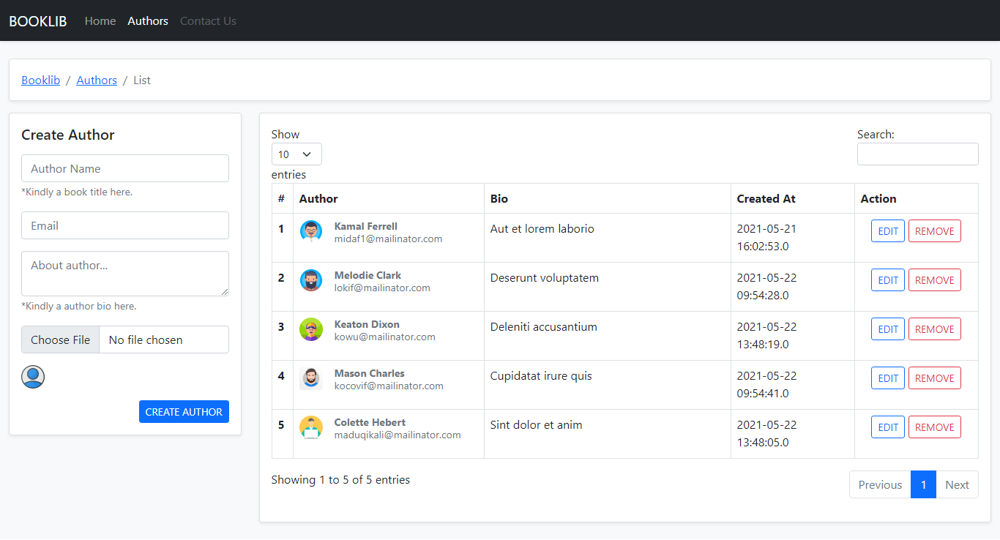
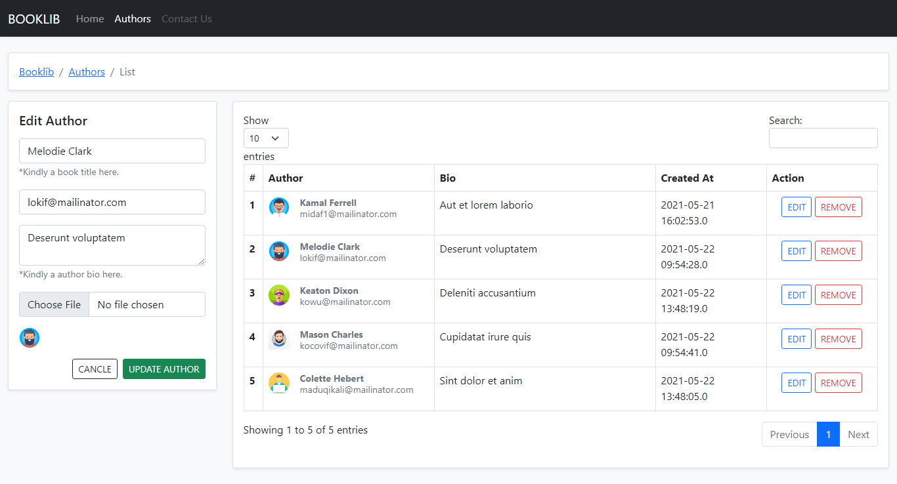
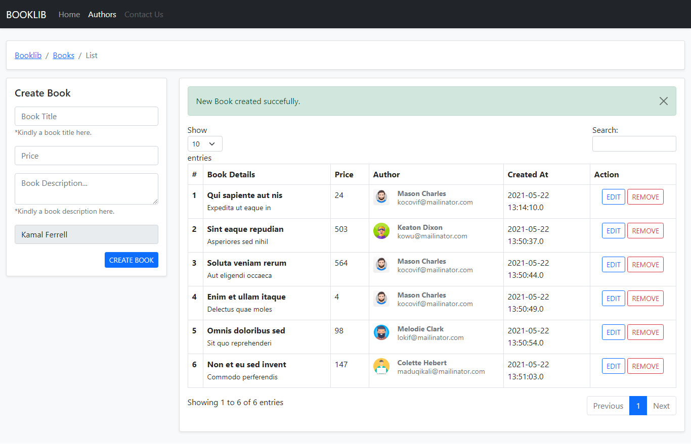

## BookLib-A-Portal-for-library (JAVA | JSP | SERVLET | JDBC | MYSQL | TOMCATE | NETBEANS V.12)

### Introduction
---
BookLib is a portal where we can store books by it's authors details. and easily search books or author from library.

Basically i build this project for learning purpose and it is devloped in JAVA Technologies. using JSP Servlet JDBC and MySql Database.

## ScreenShots

## Author page create and show

## Edit Author page with list of author

## Book page with create a new book and show list of books

## Issues
If you have any issues please report them [here](https://github.com/helloKeyur/PayrollSystem/issues).

## Contribution
Please feel free to make any project-related pull requests. You should give us an email at the following addresses if you wish to propose any new updates or features to the project.

    1. Keyur Vamja - keyur.vamja.it@gmail.com
